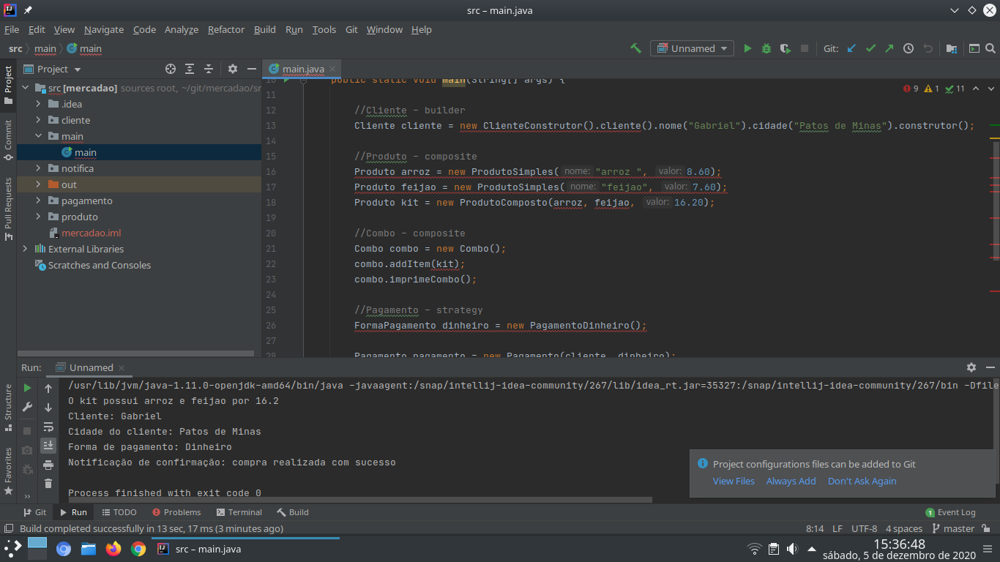

# Mercadão Project

## Descrição do projeto

Software que emite detalhes de uma compra com as respectivas informações:

- Cliente e a cidade do cliente que realizou a compra,
- Produtos da compra possibilitando criar combos,
- Meio de pagamento usado para a compra,
- Notificação de confirmação.

# Demonstração

- IDE utilizada para desenvolvimento: [IDEA Intellij](https://www.jetbrains.com/pt-br/idea/)

# Patterns utilizados
### OBS: Sendo permitido na descrição da APS trabalhar com pattern Observer em diante seguindo o plano de aula no Portal do Aluno.

- Builder: Usado para criar o objeto cliente e possibilitar associar o pagamento da compra usando uma das estratégias como dinheiro e cartão a um cliente e a cidade deste cliente. Sendo um padrão de projeto de software criacional que permite a separação da construção de um objeto complexo na representação, de forma que o mesmo processo de construção possa criar diferentes representações.

- Composite: Foi usado para criar o combo de produtos, sendo produtos divididos em simples e compostos. É um padrão de projeto estrutural que permite que componha objetos em estruturas de árvores e então trabalhe com essas estruturas como se elas fossem objetos individuais.

- Observer: Foi usado para possibilitar a notificação dentro do sistema para informar que a compra foi concluída com sucesso. É um padrão de projeto comportamental que permite que defina um mecanismo de assinatura para notificar múltiplos objetos sobre quaisquer eventos que aconteçam com o objeto que eles estão observando.

- Strategy: Usado para aplicar estratégias de pagamento podendo optar pelo cartão ou dinheiro. Se trata de um padrão de projeto criacional que permite construir objetos complexos passo a passo. O padrão permite produzir diferentes tipos e representações de um objeto usando o mesmo código de construção.

# Autores

- Leandro Cunha (usuário: leandrocunha526) - e-mail: leandrocunha526@gmail.com
- Gabriel Marra (usuário: gmmarra33) - e-mail: gabrielgtba2009@hotmail.com

# Docs
- [Basic writing and formatting syntax](https://docs.github.com/pt/free-pro-team@latest/github/writing-on-github/basic-writing-and-formatting-syntax)
- [Java Point](https://www.javatpoint.com/java-tutorial)
- [Refactoring Guru](https://refactoring.guru/)
